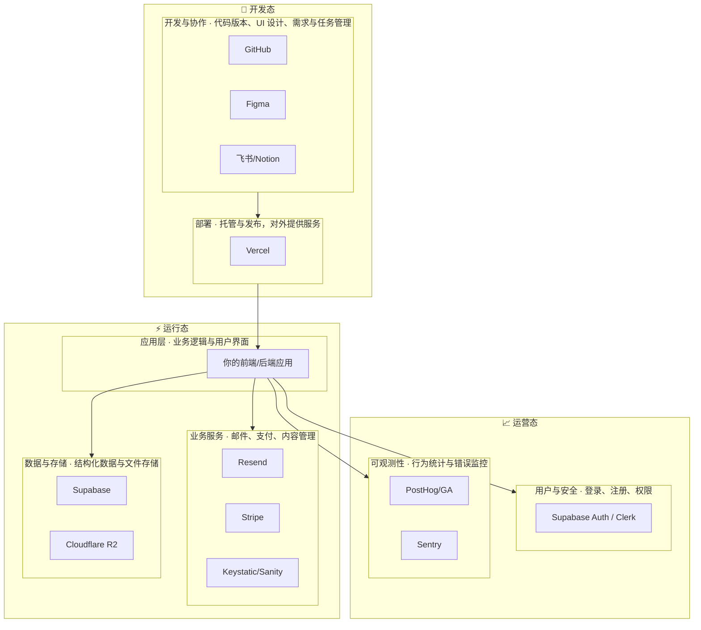

我将根据您提供的两张图片内容，整理成完整的表格如下：
| 分类       | 工具                     | 通俗描述                     | 免费额度亮点                                                                 |
|------------|--------------------------|------------------------------|-----------------------------------------------------------------------------|
| 部署       | Vercel                   | 应用在互联网上的"家"           | 无限个人项目，每月100GB免费流量                                               |
| 数据库     | Supabase                 | 应用的"大脑"与长期记忆库       | 2个免费项目，支持5万月活用户                                                 |
| 用户认证   | Supabase、Clerk           | 应用的"保安"，负责管理用户登录 | Supabase支持5万月活用户；Clerk支持1万月活用户                                   |
| 文件存储   | Cloudflare R2            | 应用的"文件柜"，存放用户上传的内容 | 10GB免费存储，无出口带宽费用                                                 |
| 邮件服务   | Resend                   | 应用的"邮递员"，发送各类通知邮件 | 每月3000封免费邮件                                                           |
| 数据统计   | PostHog、Google Analytics（GA） | 应用的"数据分析师"，追踪用户行为 | PostHog支持每月100万次事件；GA完全免费                                         |
| 应用监控   | Sentry                   | 应用的"医生"，实时报告程序错误 | 免费额度足以覆盖个人项目（每月5000次错误监测）                                 |
| 内容管理   | Keystatic、Sanity         | 应用的"内容编辑器"，无须编写代码即可更新内容 | Keystatic开源免费；Sanity提供基础免费额度                                     |
| 支付       | Stripe                   | 应用的"收银台"，处理收款交易   | 无月费，仅按交易流水收费                                                     |
| 设计       | Figma                    | 应用的"设计画板"               | 3个项目文件免费使用                                                          |
| 代码管理   | GitHub                   | 项目的"游戏存档"服务器         | 无限免费公共/私有仓库                                                        |
| 任务/笔记  | 飞书、Notion             | 你的项目"指挥中心"和笔记本      | 强大的个人免费版                                                             |

---

## 全栈架构图

### 分层说明

| 阶段 | 层级 | 组成 | 作用 |
|------|------|------|------|
| **开发态** | 开发与协作 | GitHub、Figma、飞书/Notion | 代码版本、UI 设计、需求与任务管理 |
| | 部署 | Vercel | 托管与发布，对外提供服务 |
| **运行态** | 应用层 | 你的前端/后端应用 | 业务逻辑与用户界面 |
| | 业务服务 | Resend、Stripe、CMS | 邮件、支付、内容管理 |
| | 数据与存储 | Supabase、Cloudflare R2 | 结构化数据与文件存储 |
| **运营态** | 用户与安全 | Supabase Auth / Clerk | 登录、注册、权限 |
| | 可观测性 | PostHog/GA、Sentry | 行为统计与错误监控 |

**阶段关系**：开发态（开发与协作 → 部署）→ 运行态（应用层 调用 业务服务、数据与存储）→ 运营态（用户与安全、可观测性 保障应用运行与迭代）。
