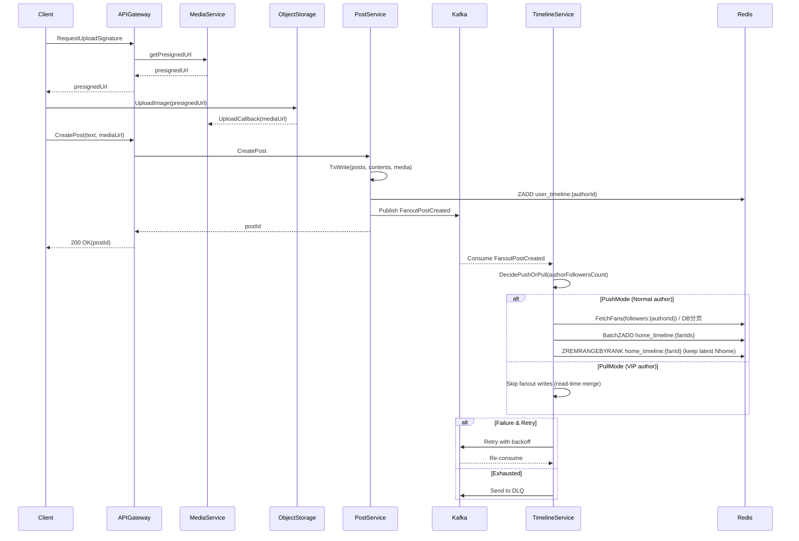
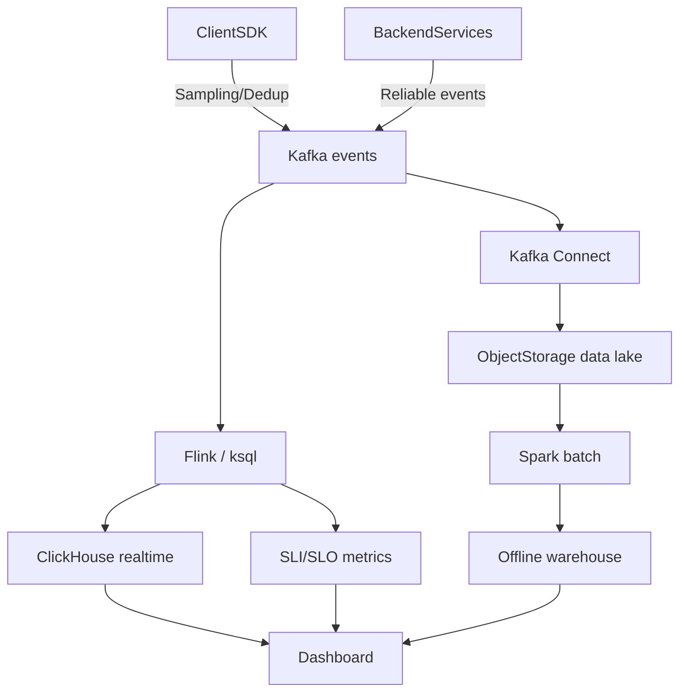

PRD = r"""
## 微博系统（类 Twitter）架构设计文档（中型规模）

### 1. 背景与目标

设计一个类 Twitter 的微博系统，面向 **DAU 10 万 ~ 1000 万** 的中型规模，支持 **多可用区（Multi-AZ）** 部署，并满足：

- **核心能力（MVP）**：发微博（文本+图片）、关注/取关、时间线（Home 关注流 + User 个人页）、数据分析（事件采集与基础报表）。
- **性能目标（示例）**：
  - Home 时间线 P95 < 200ms
  - 发微博 P95 < 300ms（不含图片上传直传耗时）
- **一致性目标**：
  - 微博详情：强一致（读 DB/缓存回源）
  - 时间线：允许秒级最终一致（异步扩散 / 合并）
- **可用性目标（示例）**：核心读路径 99.9% 月可用性；写路径 99.5%（可后续提升）。

### 2. 范围与非目标

#### 2.1 MVP 范围
- 发微博：文本 + 图片（图片走对象存储直传）
- 关注关系：关注/取关
- 时间线：
  - Home：关注流（混合推拉）
  - User：个人页（按作者最新微博）
- 分析：事件采集 + 看板（DAU、发帖量、曝光/点击、关注/取关量）

#### 2.2 非目标（本版不做/弱化，但预留扩展点）
- 评论、转发、点赞、收藏、私信
- 全文搜索、话题页、推荐排序、热榜
- 强审核/反垃圾闭环（仅做基础限流与风控预留）

### 3. 关键假设与约束
- 读多写少，Home 时间线是主要热点读接口。
- 允许时间线最终一致，避免写扩散阻塞发帖请求。
- 分析链路与业务链路解耦，不能影响核心读写 SLA。
- 需要具备水平扩展能力：应用层无状态 + 存储层分片预案。

### 4. 总体架构

#### 4.1 分层
- **接入层**：API Gateway / Ingress
  - TLS、鉴权、限流、灰度发布、统一日志与 Trace 透传
- **业务服务层**（建议按领域拆分，可按团队规模合并）
  - `AuthService`：登录态与鉴权（JWT/Session），风控开关
  - `UserService`：用户资料、计数器（关注/粉丝/微博数）
  - `SocialGraphService`：关注关系（写优化、双向查询）
  - `PostService`：微博元数据、内容、媒体引用
  - `TimelineService`：Home/User 时间线构建与读取（混合推拉）
  - `MediaService`：上传签名、回调、（可选）转码
  - `AnalyticsIngest`：事件采集（也可由网关或 SDK 直写 MQ）
- **数据与基础设施层**
  - OLTP：MySQL / PostgreSQL（读写分离 + 分片预案）
  - Cache：Redis Cluster（KV、SET、ZSET、热点保护）
  - MQ：Kafka（发帖 fanout、异步任务、分析埋点）
  - Object Storage：S3/OSS/MinIO（图片）
  - Analytics：ClickHouse（实时看板）+ 数据湖（离线）

#### 4.2 核心数据流（高层）
- 发帖：API -> PostService（事务写 DB）-> MQ（FanoutPostCreated）-> TimelineService（异步扩散到 Redis）
- 读 Home：API -> TimelineService（优先 Redis）-> 详情聚合（PostService/UserService 缓存）
- 分析：SDK/服务端 -> MQ(events) -> 流处理 -> ClickHouse/湖

### 5. 数据模型设计

> 说明：这里给出 **逻辑模型 + 关键索引**。物理分库分表可后续按容量演进。

#### 5.1 用户
- `users(id, handle, phone/email, status, created_at, ...)`
- `user_profiles(user_id, name, avatar_url, bio, ...)`

#### 5.2 关注关系（社交图）
- 表：`follows(follower_id, followee_id, created_at)`
  - UNIQUE(`follower_id`, `followee_id`)
  - INDEX(`followee_id`, `created_at`)：粉丝列表分页
  - INDEX(`follower_id`, `created_at`)：关注列表分页

Redis 读模型（可选，用于加速 Home 合并与阈值判断）：
- `following:{userId}` -> SET（关注的人）
- `followers:{userId}` -> SET（粉丝）
- `followers_count:{userId}` -> INT（计数器，避免频繁 SCARD）

#### 5.3 微博
- `posts(id, author_id, created_at, visibility, status, ...)`
  - INDEX(`author_id`, `created_at` DESC)
- `post_contents(post_id, text, ...)`（大字段单独表利于热数据）
- `post_media(post_id, media_url, media_type, width, height, ...)`

#### 5.4 时间线（读模型优先 Redis）
- `user_timeline:{userId}` -> ZSET(score=created_at_ts, member=postId)（个人页）
- `home_timeline:{userId}` -> ZSET（Home 关注流，推模式写入）

持久化时间线（可选，建议规模上来后引入，用于冷数据与重建）：
- `home_timeline_items(user_id, created_at, post_id)`，INDEX(`user_id`, `created_at` DESC)

#### 5.5 分析事件
- MQ topic：`events`
  - 字段：`event_type, user_id, post_id?, ts, attrs(kv)`

### 6. 核心链路设计

#### 6.1 图片上传（直传对象存储）
1) 客户端向 `MediaService` 申请预签名 URL（鉴权、配额、大小校验）  
2) 客户端直传对象存储（减少业务带宽与延迟）  
3) 对象存储回调 `MediaService`（校验、生成 media_id / url）

#### 6.2 发微博（写路径：强一致落库 + 异步扩散）
目标：发帖 API 快速返回，时间线异步可见。

1) `PostService` 事务写入：`posts` + `post_contents` + `post_media`  
2) 同步写入作者个人页缓存：`ZADD user_timeline:{authorId}`  
3) 发送 MQ 消息：`FanoutPostCreated(postId, authorId, createdAt)`  
4) `TimelineService` 消费消息，执行 **混合推拉 fanout**

混合推拉策略：
- **普通作者（粉丝较少）**：推模式（fanout-on-write），批量写入粉丝的 `home_timeline:{fanId}` ZSET
- **大 V（粉丝过多）**：拉模式（fanout-on-read），不对所有粉丝推；在粉丝拉取 Home 时合并大 V 最新微博
- **阈值示例**：`followers_count > 50_000` 进入拉模式（可动态配置）

#### 6.3 拉取 Home 时间线（读路径：优先缓存 + 合并补齐）
目标：P95 < 200ms，避免深分页与 cache miss 风暴。

- Step A：从 `home_timeline:{userId}` 读取一页 postId（游标分页）  
- Step B：对拉模式的大 V：读取 `user_timeline:{vipId}` 的最近 N 条，在服务端做多路归并（k-way merge）  
- Step C：去重、截断、排序  
- Step D：批量拉取微博详情（PostService）与作者信息（UserService），用缓存与批量接口降低放大

分页建议：
- 使用游标（`max_ts` + `last_post_id`）而不是 offset，避免深分页退化。
- `home_timeline` 只保留最近 `N=1000`（示例）条，超出截断。

### 7. 缓存、队列与一致性策略

#### 7.1 Redis Key 设计建议
- 时间线 ZSET：只存 `postId`，避免大 value；按 `userId` 分散
- 关注集合：SET；大集合需关注内存与迁移成本
- 详情缓存（示例）：
  - `post:{postId}` -> JSON（TTL 5~30 分钟，热点延长）
  - `user:{userId}` -> JSON（TTL 10~60 分钟）

#### 7.2 缓存击穿/雪崩保护
- 单飞（singleflight）/请求合并：同一 postId 回源只允许一个并发
- 随机 TTL 抖动：避免同一时刻集体过期
- 热点 key：逻辑过期 + 异步刷新（可选）

#### 7.3 MQ 与重试
- Topic：`fanout`
  - 分区键建议：`authorId`（保证同一作者顺序）或 `postId`
  - 消费者：TimelineService（可水平扩容）
- 失败处理：
  - 重试（指数退避）+ 死信队列（DLQ）
  - 幂等：对同一 `(userId, postId)` 重复写入需可接受（ZSET member 覆盖）

#### 7.4 一致性分层
- 详情页：以 DB 为准，缓存失效可回源
- 时间线：最终一致（异步扩散/合并），允许短暂缺失或重复（客户端去重）

### 8. 分析链路（事件驱动）

#### 8.1 事件采集
- 客户端埋点：曝光、点击（建议客户端去重/采样）
- 服务端埋点：发帖、关注/取关（更可信）

#### 8.2 实时与离线
- 实时：Kafka -> Flink/ksql -> ClickHouse（分钟级延迟看板）
- 离线：Kafka Connect -> 对象存储（Parquet）-> Spark（留存、漏斗）

#### 8.3 基础指标（MVP）
- DAU/WAU/MAU
- 发帖量、发帖用户数
- 关注/取关量
- 曝光、点击、CTR（按入口/版本/实验桶）
- Fanout 延迟分布、时间线命中率

### 9. 可用性、容灾与运维

#### 9.1 多可用区部署
- 应用服务：无状态多副本，跨 AZ
- DB：主从/多副本（跨 AZ），读写分离
- Redis Cluster：多副本，跨 AZ
- Kafka：3 副本（跨 AZ）

#### 9.2 降级与故障策略
- Redis 异常：降级为“仅个人页”或“仅大 V 拉模式合并”
- MQ 异常：仍可落库，但记录补偿任务（异步补 fanout）

#### 9.3 观测
- 指标：QPS、错误率、P95、Redis 命中率、Kafka lag、fanout 延迟
- 日志：统一 traceId；关键业务事件（发帖/关注）
- 告警：SLO burn rate、DB 复制延迟、Redis 命中率突降、Kafka lag 飙升

### 10. 安全与风控（MVP）
- 网关限流：按 userId / IP；对发帖/关注更严格
- 频控示例：
  - 发帖：每用户每分钟 1~3 次（可按等级放宽）
  - 关注：每用户每分钟 10~30 次
- 审计：关键操作审计日志；敏感信息最小化存储

### 11. 容量估算与参数示例（参考）

#### 11.1 量级假设（示例）
- DAU：5,000,000
- 人均关注数：300
- 人均发帖：0.2/日
- 发帖量：1,000,000/日（平均 ~11.6/s，峰值按 10x）
- Home 请求：人均 20 次/日 => 1e8/日（平均 ~1,157/s，峰值按 10x）

#### 11.2 粗略容量拆解（示例参数）
> 目的：给出“可演算”的量级，便于第一版资源申请与压测目标设置。数字不追求精确，重点是方法与关键参数。

**请求量（QPS）**（按 10x 峰值系数）：
- HomeTimeline：平均 ~1,157/s，峰值 ~11,570/s
- CreatePost：平均 ~11.6/s，峰值 ~116/s
- Follow/Unfollow：若人均 1 次/日 => 5,000,000/日（平均 ~58/s，峰值 ~580/s）

**存储量（OLTP）**（按 280 字符文本 + 元数据 + 索引粗估）：
- posts+contents：假设单条（含索引摊销）约 1~2KB
- 1,000,000/日 => 1~2GB/日；保留 180 天 => 180~360GB（未含图片；图片在对象存储）

#### 11.3 Redis：时间线与社交图（示例）
时间线 ZSET（仅存 postId + score）：
- `home_timeline` 每用户保留最近 N=1000 条
- 粗略按 120B/条（含结构/指针/编码开销，按经验区间 80~200B）
- 若“活跃有缓存 Home”的用户数 \(U_{cache}\)=500,000：
  - 容量 \(\approx U_{cache} * N * 120B = 500,000 * 1,000 * 120B \approx 60GB\)
- `user_timeline`：作者侧通常更小，可按活跃作者数再加 10~30GB 级别（依 N 与活跃作者数）

社交图集合（following/followers）：
- following：\(U_{cache} * 300\) 关系，若按 32B/成员（很粗）=> ~4.8GB 量级
- followers：长尾更大且迁移更重，建议用计数器 + 分页 DB/缓存混合，避免把“全量粉丝集合”当作硬依赖

冗余与规划：
- Redis Cluster 多副本 + 碎片 + 预留：按 2~3 倍规划（例如 60GB 逻辑数据 => 120~180GB 实际集群内存）
- 大 key 控制：`home_timeline` 截断到 N；对极端用户启用拉模式/降级

#### 11.4 Fanout 写放大与 Kafka（示例）
Fanout 写放大（推模式）：
- 普通作者平均粉丝 200：每发帖写入约 200 个 `home_timeline`
- 峰值发帖 116/s => 23,200 次 ZADD/s（应使用 pipeline/批量 + 多分片）

Kafka 主题建议（示例）：
- `fanout`：post created 事件
  - 分区数：先按 48~96（取决于吞吐与消费并行度），分区键可用 `authorId` 保序
  - 保留：24~72 小时（仅作为扩散队列/重试缓冲）
- `events`：分析事件
  - 分区数：按峰值写入（曝光/点击可能很大）独立评估；可用 userId/hash 分散
  - 保留：3~7 天（实时处理），同时落湖做长期

#### 11.5 SLO/SLI 与限流阈值（示例参数）
> 说明：SLO 要和“降级策略”一起定义；核心是让系统在异常时优先保读。

**核心 API（延迟 SLO）**：
- HomeTimeline：**P95 < 200ms，P99 < 400ms**
- PostDetail：**P95 < 150ms，P99 < 300ms**
- CreatePost：**P95 < 300ms，P99 < 600ms**（不含图片直传）
- Follow/Unfollow：**P95 < 200ms，P99 < 400ms**

**可用性 SLO**（示例）：
- 读路径（HomeTimeline/PostDetail）：**99.9% / 月**
- 写路径（CreatePost/Follow）：**99.5% / 月**

**错误预算（示例）**：
- 99.9%：每月约 43 分钟不可用预算；用于驱动 burn rate 告警

**网关限流（示例，按 userId）**：
- CreatePost：1 rps（burst 3），并加“每日上限/分级”：
  - 普通：200/日；高等级：1,000/日（示例）
- Follow/Unfollow：5 rps（burst 10），并加“每日上限” 2,000/日（示例）
- HomeTimeline：20 rps（burst 50）；若触发限流返回 429 + 客户端退避

**系统保护阈值（示例）**：
- `home_timeline:{user}` 单次请求最大合并大V数：K=50（超出只取最近活跃/按优先级裁剪）
- 合并读取每个大V `user_timeline` 取最近 Nvip=50（上限 100）
- Redis ZSET 单 key 最大长度：Nhome=1000，Nuser=2000（示例）
- 事件上报：曝光/点击客户端采样 10%（可动态下发），服务端事件全量

### 12. 演进路线
- 引入持久化时间线表（冷数据、重建、降低对 Redis 的强依赖）
- 引入搜索与话题（OpenSearch/ES）
- 引入推荐/热榜（事件 + 图 + 内容特征）
- 向多地域多活演进：按用户分区路由 + 异步复制 + 一致性策略升级

---

### 附录：关键流程 Mermaid 图

#### A1. 发微博与 Fanout（混合推拉）


#### A2. 拉取 Home 时间线（缓存优先 + 大V合并）
```mermaid
flowchart TD
  Client[Client] --> GW[APIGateway]
  GW --> TL[TimelineService]
  TL -->|"ReadZSET(cursor)"| RedisHome[Redis home_timeline:{user}]
  TL -->|"CacheMiss/NeedOlder"| Fallback[Fallback path]
  Fallback --> DBTL[(Optional DB home_timeline_items)]
  Fallback --> PullMerge[Pull merge from followings]

  TL -->|"NeedVipMerge"| Graph[SocialGraphService]
  Graph --> RedisFollow[Redis following:{user}]
  Graph --> DBFollow[(DB follows pagination)]

  TL -->|"ReadZSET(Nvip)"| RedisUserTL[Redis user_timeline:{vip}]
  TL --> Merge[k-way merge + dedup + truncate]
  RedisHome --> Merge
  RedisUserTL --> Merge
  DBTL --> Merge
  PullMerge --> Merge

  Merge --> Post[PostService batchGet(postIds)]
  Merge --> User[UserService batchGet(authorIds)]
  Post --> CachePost[Redis post:{postId}]
  User --> CacheUser[Redis user:{userId}]
  CachePost --> Resp[Response]
  CacheUser --> Resp
  Resp --> GW --> Client
```

#### A3. 分析链路（实时 + 离线）

"""
PRD = r"""
## 微博系统（类 Twitter）架构设计文档（中型规模）

### 1. 背景与目标

设计一个类 Twitter 的微博系统，面向 **DAU 10 万 ~ 1000 万** 的中型规模，支持 **多可用区（Multi-AZ）** 部署，并满足：

- **核心能力（MVP）**：发微博（文本+图片）、关注/取关、时间线（Home 关注流 + User 个人页）、数据分析（事件采集与基础报表）。
- **性能目标（示例）**：
  - Home 时间线 P95 < 200ms
  - 发微博 P95 < 300ms（不含图片上传直传耗时）
- **一致性目标**：
  - 微博详情：强一致（读 DB/缓存回源）
  - 时间线：允许秒级最终一致（异步扩散 / 合并）
- **可用性目标（示例）**：核心读路径 99.9% 月可用性；写路径 99.5%（可后续提升）。

### 2. 范围与非目标

#### 2.1 MVP 范围
- 发微博：文本 + 图片（图片走对象存储直传）
- 关注关系：关注/取关
- 时间线：
  - Home：关注流（混合推拉）
  - User：个人页（按作者最新微博）
- 分析：事件采集 + 看板（DAU、发帖量、曝光/点击、关注/取关量）

#### 2.2 非目标（本版不做/弱化，但预留扩展点）
- 评论、转发、点赞、收藏、私信
- 全文搜索、话题页、推荐排序、热榜
- 强审核/反垃圾闭环（仅做基础限流与风控预留）

### 3. 关键假设与约束
- 读多写少，Home 时间线是主要热点读接口。
- 允许时间线最终一致，避免写扩散阻塞发帖请求。
- 分析链路与业务链路解耦，不能影响核心读写 SLA。
- 需要具备水平扩展能力：应用层无状态 + 存储层分片预案。

### 4. 总体架构

#### 4.1 分层
- **接入层**：API Gateway / Ingress
  - TLS、鉴权、限流、灰度发布、统一日志与 Trace 透传
- **业务服务层**（建议按领域拆分，可按团队规模合并）
  - `AuthService`：登录态与鉴权（JWT/Session），风控开关
  - `UserService`：用户资料、计数器（关注/粉丝/微博数）
  - `SocialGraphService`：关注关系（写优化、双向查询）
  - `PostService`：微博元数据、内容、媒体引用
  - `TimelineService`：Home/User 时间线构建与读取（混合推拉）
  - `MediaService`：上传签名、回调、（可选）转码
  - `AnalyticsIngest`：事件采集（也可由网关或 SDK 直写 MQ）
- **数据与基础设施层**
  - OLTP：MySQL / PostgreSQL（读写分离 + 分片预案）
  - Cache：Redis Cluster（KV、SET、ZSET、热点保护）
  - MQ：Kafka（发帖 fanout、异步任务、分析埋点）
  - Object Storage：S3/OSS/MinIO（图片）
  - Analytics：ClickHouse（实时看板）+ 数据湖（离线）

#### 4.2 核心数据流（高层）
- 发帖：API -> PostService（事务写 DB）-> MQ（FanoutPostCreated）-> TimelineService（异步扩散到 Redis）
- 读 Home：API -> TimelineService（优先 Redis）-> 详情聚合（PostService/UserService 缓存）
- 分析：SDK/服务端 -> MQ(events) -> 流处理 -> ClickHouse/湖

### 5. 数据模型设计

> 说明：这里给出 **逻辑模型 + 关键索引**。物理分库分表可后续按容量演进。

#### 5.1 用户
- `users(id, handle, phone/email, status, created_at, ...)`
- `user_profiles(user_id, name, avatar_url, bio, ...)`

#### 5.2 关注关系（社交图）
- 表：`follows(follower_id, followee_id, created_at)`
  - UNIQUE(`follower_id`, `followee_id`)
  - INDEX(`followee_id`, `created_at`)：粉丝列表分页
  - INDEX(`follower_id`, `created_at`)：关注列表分页

Redis 读模型（可选，用于加速 Home 合并与阈值判断）：
- `following:{userId}` -> SET（关注的人）
- `followers:{userId}` -> SET（粉丝）
- `followers_count:{userId}` -> INT（计数器，避免频繁 SCARD）

#### 5.3 微博
- `posts(id, author_id, created_at, visibility, status, ...)`
  - INDEX(`author_id`, `created_at` DESC)
- `post_contents(post_id, text, ...)`（大字段单独表利于热数据）
- `post_media(post_id, media_url, media_type, width, height, ...)`

#### 5.4 时间线（读模型优先 Redis）
- `user_timeline:{userId}` -> ZSET(score=created_at_ts, member=postId)（个人页）
- `home_timeline:{userId}` -> ZSET（Home 关注流，推模式写入）

持久化时间线（可选，建议规模上来后引入，用于冷数据与重建）：
- `home_timeline_items(user_id, created_at, post_id)`，INDEX(`user_id`, `created_at` DESC)

#### 5.5 分析事件
- MQ topic：`events`
  - 字段：`event_type, user_id, post_id?, ts, attrs(kv)`

### 6. 核心链路设计

#### 6.1 图片上传（直传对象存储）
1) 客户端向 `MediaService` 申请预签名 URL（鉴权、配额、大小校验）  
2) 客户端直传对象存储（减少业务带宽与延迟）  
3) 对象存储回调 `MediaService`（校验、生成 media_id / url）

#### 6.2 发微博（写路径：强一致落库 + 异步扩散）
目标：发帖 API 快速返回，时间线异步可见。

1) `PostService` 事务写入：`posts` + `post_contents` + `post_media`  
2) 同步写入作者个人页缓存：`ZADD user_timeline:{authorId}`  
3) 发送 MQ 消息：`FanoutPostCreated(postId, authorId, createdAt)`  
4) `TimelineService` 消费消息，执行 **混合推拉 fanout**

混合推拉策略：
- **普通作者（粉丝较少）**：推模式（fanout-on-write），批量写入粉丝的 `home_timeline:{fanId}` ZSET
- **大 V（粉丝过多）**：拉模式（fanout-on-read），不对所有粉丝推；在粉丝拉取 Home 时合并大 V 最新微博
- **阈值示例**：`followers_count > 50_000` 进入拉模式（可动态配置）

#### 6.3 拉取 Home 时间线（读路径：优先缓存 + 合并补齐）
目标：P95 < 200ms，避免深分页与 cache miss 风暴。

- Step A：从 `home_timeline:{userId}` 读取一页 postId（游标分页）  
- Step B：对拉模式的大 V：读取 `user_timeline:{vipId}` 的最近 N 条，在服务端做多路归并（k-way merge）  
- Step C：去重、截断、排序  
- Step D：批量拉取微博详情（PostService）与作者信息（UserService），用缓存与批量接口降低放大

分页建议：
- 使用游标（`max_ts` + `last_post_id`）而不是 offset，避免深分页退化。
- `home_timeline` 只保留最近 `N=1000`（示例）条，超出截断。

### 7. 缓存、队列与一致性策略

#### 7.1 Redis Key 设计建议
- 时间线 ZSET：只存 `postId`，避免大 value；按 `userId` 分散
- 关注集合：SET；大集合需关注内存与迁移成本
- 详情缓存（示例）：
  - `post:{postId}` -> JSON（TTL 5~30 分钟，热点延长）
  - `user:{userId}` -> JSON（TTL 10~60 分钟）

#### 7.2 缓存击穿/雪崩保护
- 单飞（singleflight）/请求合并：同一 postId 回源只允许一个并发
- 随机 TTL 抖动：避免同一时刻集体过期
- 热点 key：逻辑过期 + 异步刷新（可选）

#### 7.3 MQ 与重试
- Topic：`fanout`
  - 分区键建议：`authorId`（保证同一作者顺序）或 `postId`
  - 消费者：TimelineService（可水平扩容）
- 失败处理：
  - 重试（指数退避）+ 死信队列（DLQ）
  - 幂等：对同一 `(userId, postId)` 重复写入需可接受（ZSET member 覆盖）

#### 7.4 一致性分层
- 详情页：以 DB 为准，缓存失效可回源
- 时间线：最终一致（异步扩散/合并），允许短暂缺失或重复（客户端去重）

### 8. 分析链路（事件驱动）

#### 8.1 事件采集
- 客户端埋点：曝光、点击（建议客户端去重/采样）
- 服务端埋点：发帖、关注/取关（更可信）

#### 8.2 实时与离线
- 实时：Kafka -> Flink/ksql -> ClickHouse（分钟级延迟看板）
- 离线：Kafka Connect -> 对象存储（Parquet）-> Spark（留存、漏斗）

#### 8.3 基础指标（MVP）
- DAU/WAU/MAU
- 发帖量、发帖用户数
- 关注/取关量
- 曝光、点击、CTR（按入口/版本/实验桶）
- Fanout 延迟分布、时间线命中率

### 9. 可用性、容灾与运维

#### 9.1 多可用区部署
- 应用服务：无状态多副本，跨 AZ
- DB：主从/多副本（跨 AZ），读写分离
- Redis Cluster：多副本，跨 AZ
- Kafka：3 副本（跨 AZ）

#### 9.2 降级与故障策略
- Redis 异常：降级为“仅个人页”或“仅大 V 拉模式合并”
- MQ 异常：仍可落库，但记录补偿任务（异步补 fanout）

#### 9.3 观测
- 指标：QPS、错误率、P95、Redis 命中率、Kafka lag、fanout 延迟
- 日志：统一 traceId；关键业务事件（发帖/关注）
- 告警：SLO burn rate、DB 复制延迟、Redis 命中率突降、Kafka lag 飙升

### 10. 安全与风控（MVP）
- 网关限流：按 userId / IP；对发帖/关注更严格
- 频控示例：
  - 发帖：每用户每分钟 1~3 次（可按等级放宽）
  - 关注：每用户每分钟 10~30 次
- 审计：关键操作审计日志；敏感信息最小化存储

### 11. 容量估算与参数示例（参考）

#### 11.1 量级假设（示例）
- DAU：5,000,000
- 人均关注数：300
- 人均发帖：0.2/日
- 发帖量：1,000,000/日（平均 ~11.6/s，峰值按 10x）
- Home 请求：人均 20 次/日 => 1e8/日（平均 ~1,157/s，峰值按 10x）

#### 11.2 粗略容量拆解（示例参数）
> 目的：给出“可演算”的量级，便于第一版资源申请与压测目标设置。数字不追求精确，重点是方法与关键参数。

**请求量（QPS）**（按 10x 峰值系数）：
- HomeTimeline：平均 ~1,157/s，峰值 ~11,570/s
- CreatePost：平均 ~11.6/s，峰值 ~116/s
- Follow/Unfollow：若人均 1 次/日 => 5,000,000/日（平均 ~58/s，峰值 ~580/s）

**存储量（OLTP）**（按 280 字符文本 + 元数据 + 索引粗估）：
- posts+contents：假设单条（含索引摊销）约 1~2KB
- 1,000,000/日 => 1~2GB/日；保留 180 天 => 180~360GB（未含图片；图片在对象存储）

#### 11.3 Redis：时间线与社交图（示例）
时间线 ZSET（仅存 postId + score）：
- `home_timeline` 每用户保留最近 N=1000 条
- 粗略按 120B/条（含结构/指针/编码开销，按经验区间 80~200B）
- 若“活跃有缓存 Home”的用户数 \(U_{cache}\)=500,000：
  - 容量 \(\approx U_{cache} * N * 120B = 500,000 * 1,000 * 120B \approx 60GB\)
- `user_timeline`：作者侧通常更小，可按活跃作者数再加 10~30GB 级别（依 N 与活跃作者数）

社交图集合（following/followers）：
- following：\(U_{cache} * 300\) 关系，若按 32B/成员（很粗）=> ~4.8GB 量级
- followers：长尾更大且迁移更重，建议用计数器 + 分页 DB/缓存混合，避免把“全量粉丝集合”当作硬依赖

冗余与规划：
- Redis Cluster 多副本 + 碎片 + 预留：按 2~3 倍规划（例如 60GB 逻辑数据 => 120~180GB 实际集群内存）
- 大 key 控制：`home_timeline` 截断到 N；对极端用户启用拉模式/降级

#### 11.4 Fanout 写放大与 Kafka（示例）
Fanout 写放大（推模式）：
- 普通作者平均粉丝 200：每发帖写入约 200 个 `home_timeline`
- 峰值发帖 116/s => 23,200 次 ZADD/s（应使用 pipeline/批量 + 多分片）

Kafka 主题建议（示例）：
- `fanout`：post created 事件
  - 分区数：先按 48~96（取决于吞吐与消费并行度），分区键可用 `authorId` 保序
  - 保留：24~72 小时（仅作为扩散队列/重试缓冲）
- `events`：分析事件
  - 分区数：按峰值写入（曝光/点击可能很大）独立评估；可用 userId/hash 分散
  - 保留：3~7 天（实时处理），同时落湖做长期

#### 11.5 SLO/SLI 与限流阈值（示例参数）
> 说明：SLO 要和“降级策略”一起定义；核心是让系统在异常时优先保读。

**核心 API（延迟 SLO）**：
- HomeTimeline：**P95 < 200ms，P99 < 400ms**
- PostDetail：**P95 < 150ms，P99 < 300ms**
- CreatePost：**P95 < 300ms，P99 < 600ms**（不含图片直传）
- Follow/Unfollow：**P95 < 200ms，P99 < 400ms**

**可用性 SLO**（示例）：
- 读路径（HomeTimeline/PostDetail）：**99.9% / 月**
- 写路径（CreatePost/Follow）：**99.5% / 月**

**错误预算（示例）**：
- 99.9%：每月约 43 分钟不可用预算；用于驱动 burn rate 告警

**网关限流（示例，按 userId）**：
- CreatePost：1 rps（burst 3），并加“每日上限/分级”：
  - 普通：200/日；高等级：1,000/日（示例）
- Follow/Unfollow：5 rps（burst 10），并加“每日上限” 2,000/日（示例）
- HomeTimeline：20 rps（burst 50）；若触发限流返回 429 + 客户端退避

**系统保护阈值（示例）**：
- `home_timeline:{user}` 单次请求最大合并大V数：K=50（超出只取最近活跃/按优先级裁剪）
- 合并读取每个大V `user_timeline` 取最近 Nvip=50（上限 100）
- Redis ZSET 单 key 最大长度：Nhome=1000，Nuser=2000（示例）
- 事件上报：曝光/点击客户端采样 10%（可动态下发），服务端事件全量

### 12. 演进路线
- 引入持久化时间线表（冷数据、重建、降低对 Redis 的强依赖）
- 引入搜索与话题（OpenSearch/ES）
- 引入推荐/热榜（事件 + 图 + 内容特征）
- 向多地域多活演进：按用户分区路由 + 异步复制 + 一致性策略升级

---

### 附录：关键流程 Mermaid 图

#### A1. 发微博与 Fanout（混合推拉）


#### A2. 拉取 Home 时间线（缓存优先 + 大V合并）
```mermaid
flowchart TD
  Client[Client] --> GW[APIGateway]
  GW --> TL[TimelineService]
  TL -->|"ReadZSET(cursor)"| RedisHome[Redis home_timeline:{user}]
  TL -->|"CacheMiss/NeedOlder"| Fallback[Fallback path]
  Fallback --> DBTL[(Optional DB home_timeline_items)]
  Fallback --> PullMerge[Pull merge from followings]

  TL -->|"NeedVipMerge"| Graph[SocialGraphService]
  Graph --> RedisFollow[Redis following:{user}]
  Graph --> DBFollow[(DB follows pagination)]

  TL -->|"ReadZSET(Nvip)"| RedisUserTL[Redis user_timeline:{vip}]
  TL --> Merge[k-way merge + dedup + truncate]
  RedisHome --> Merge
  RedisUserTL --> Merge
  DBTL --> Merge
  PullMerge --> Merge

  Merge --> Post[PostService batchGet(postIds)]
  Merge --> User[UserService batchGet(authorIds)]
  Post --> CachePost[Redis post:{postId}]
  User --> CacheUser[Redis user:{userId}]
  CachePost --> Resp[Response]
  CacheUser --> Resp
  Resp --> GW --> Client
```

#### A3. 分析链路（实时 + 离线）

"""
