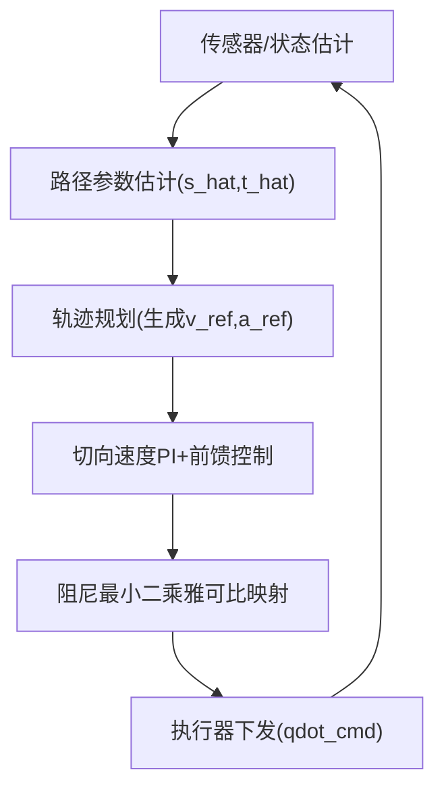
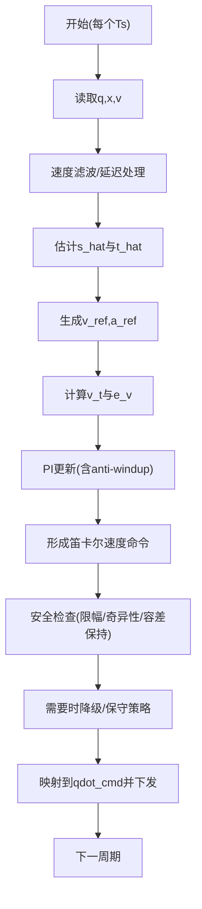

# 机械手 A 点到 B 点运动：末端速度精确 3m/s 的控制算法设计文档（不含代码）

## 1. 目标与指标

任务：控制机械手末端从 A 点移动到 B 点。  
速度指标：在运动的“匀速主段”满足 `|v-3| <= 0.05 m/s`，其中 `v` 为末端在路径切向方向上的速度幅值（等效值）。

## 2. 关键假设与符号

假设：
- 末端速度 `v` 能可靠获得（传感器或足够精确的估计）。
- 允许在笛卡尔空间构造速度/加速度参考，并通过雅可比映射到关节层执行。
- 采用路径切线方向作为“速度参考方向”，保证 A->B 的可达性与速度指标的可定义性。
- 执行器存在速度/加速度/（可选）力矩限幅，需要在控制律中进行饱和与安全降级。

符号：
- `q, qdot`：关节角与关节速度
- `x, v`：末端位姿/位置与末端速度
- `Ts`：控制采样周期
- `t_hat`：路径切向单位向量（由最近投影点估计）
- `v_t = v · t_hat`：切向速度
- `e_v = v_t - 3`：切向速度误差
- `v_ref(t), a_ref(t)`：规划器在时刻 `t` 给出的切向速度参考与前馈加速度
- `J(q)`：末端雅可比矩阵
- `J(q)^#`：阻尼最小二乘（damped least squares）伪逆

## 3. 轨迹规划（A->B 的时间参数化）

3.1 路径定义  
默认选择末端沿 `A->B` 直线运动（也可替换为最短路径/样条路径）。定义路径参数 `s`，满足 `s ∈ [0, L]`，其中 `L = |A-B|`。

3.2 速度剖面（核心：在主段长期满足紧容差）  
- 主段理想：恒定速度 `|v| = 3`，主段时间可近似为 `T_main = L/3`。  
- 过渡段：为满足执行器约束并避免匀速段进入瞬态带来的误差，采用“加速-匀速-减速”的 S 曲线（或带 jerk/加速度上限的梯形加速度）。该剖面用于确保进入匀速段后 `|v-3| <= 0.05` 能被持续保持。

3.3 参考生成  
每个控制周期输出参考：
- `v_ref(t)`：期望切向速度
- `a_ref(t)`：期望切向加速度（用于前馈，降低稳态速度误差）

路径切线估计用于把“速度方向”对齐到路径：实际控制命令中使用 `t_hat` 将速度参考投影到切向。

## 4. 控制架构（级联：轨迹跟踪 + 速度闭环）

推荐方案：笛卡尔空间“切向速度”级联控制。  
结构包含外环（速度误差与方向一致性）与内环（速度控制 + 前馈）。

4.1 外环：速度误差与方向一致性  
1) 估计切线方向：通过当前末端位置对路径的最近投影点，得到 `s_hat` 并更新 `t_hat`。  
2) 定义切向速度：`v_t = v · t_hat`。  
3) 定义速度误差：`e_v = v_t - 3`。  
4) （可选）方向/横向抑制：加入横向速度抑制项以减少偏离路径导致的“速度指标满足但 A->B 失败”。该项的目的不是改变切向速度参考，而是维持路径跟踪几何一致性。

4.2 内环：速度控制 + 前馈

控制律的实现目标是输出一个“切向加速度/速度修正量”，再与规划前馈合成命令。  
推荐：
- 前馈：使用规划得到的 `a_ref(t)`。
- 反馈：对 `e_v` 采用 PI（建议 PI 起步）。
- 抗积分饱和：当期望命令触及限幅，或出现执行器饱和/降级触发时，进行积分冻结或回灌（anti-windup），避免长期积分导致进入/离开匀速段时出现较大速度误差。

4.3 关节映射（笛卡尔->关节）
当以笛卡尔速度命令（或与速度等效的量）作为控制目标时：
- 形成切向笛卡尔速度命令：`v_cart_cmd = v_ref(t)*t_hat + v_correction`，其中 `v_correction` 由 PI 反馈输出得到（概念层面）。
- 使用阻尼最小二乘伪逆将 `v_cart_cmd` 映射到关节：
  `qdot_cmd = J(q)^# * v_cart_cmd`。
- 关节命令执行前进行限幅；接近奇异位姿时增大阻尼系数，并触发保守降级策略（例如缩短匀速段或降低速度参考）。

## 5. 每控制周期算法流程（Ts）

1) 读取：`q, x, v`（速度可测）。  
2) 处理：对速度测量做滤波/延迟补偿，降低噪声与相位滞后对 PI 的影响。  
3) 路径参数估计：计算最近投影点，得到 `s_hat` 并更新 `t_hat`。  
4) 参考生成：在当前时刻读取规划器输出的 `v_ref(t), a_ref(t)`。  
5) 误差计算：计算 `v_t = v · t_hat` 与 `e_v = v_t - 3`（必要时计算横向误差用于方向抑制）。  
6) PI 更新：结合前馈信息形成速度/加速度命令修正量，并执行 anti-windup。  
7) 形成笛卡尔命令：得到 `v_cart_cmd`（或速度等效命令）。  
8) 安全检查与降级：检查限幅、容差保持（持续时间窗口）、奇异性阈值。若不满足，则触发降级（如降低速度参考、切换更保守剖面等）。  
9) 下发控制：计算并限幅 `qdot_cmd`，下发给执行器，并记录诊断量用于调参。  
10) 进入下一周期。

## 6. 安全与约束

安全检查建议至少包含：
- 速度误差在容差带内的持续性判定：例如匀速主段窗口内 `max(|v-3|)` 的约束统计。
- 执行器饱和检测：若出现饱和，触发积分冻结/回灌，并降低控制增益或速度参考。
- 奇异性与雅可比病态检测：增大阻尼，并在必要时缩短匀速段/采用更保守的速度剖面。
- 限幅：对关节速度/加速度（或等效量）进行物理限幅，确保可实现性。

## 7. 调参与验证方法（保证 `|v-3|<=0.05`）

7.1 基于带宽的参数整定  
首先调速度闭环（PI）的带宽，使得在“速度参考从 0 接近到 3m/s 并保持”的阶段，速度误差能够在有限时间内进入 `±0.05` 容差带并保持。

7.2 误差预算与稳态验证  
将误差来源分解为：
- 速度测量噪声与滤波带来的相位滞后
- Ts 采样周期造成的离散误差
- 笛卡尔->关节映射的模型误差（雅可比误差、阻尼选取误差）
- 速度剖面进入匀速段的瞬态扰动

在此基础上调整 PI 增益、滤波参数、S 曲线过渡段长度与阻尼策略，直至匀速主段统计指标满足要求。

7.3 统计口径（建议写入验收准则）  
建议以匀速主段时间窗口 `W_main` 为统计区间，验收条件包括：
- `max(|v-3|) <= 0.05 m/s`
- `RMSE(v)` 在给定阈值以内
- 在主段持续满足容差带的占比（例如接近 100%，避免偶发尖峰）

## 8. 测试计划（可执行项）

8.1 仿真测试  
- 理想模型与扰动模型两类：摩擦/质量不确定性、外扰、速度测量噪声、时间延迟等。
- 覆盖不同 `L`（A-B 距离）、不同初始姿态、不同路径（若启用样条/曲线路径）。

8.2 硬件测试  
- 指标：匀速段 `max(|v-3|)`、`RMSE(v)`、误差持续落入容差带的稳定性。
- 覆盖：不同 A-B 距离、不同机械构型/初始关节角（含接近奇异姿态与非奇异姿态两组）。

8.3 通过标准（建议与 7.3 对齐）  
当主段统计指标满足 `|v-3|<=0.05`（按你定义的统计口径），且 A->B 到达满足位姿/位置精度要求（如你后续补充）时，认为控制算法设计可进入实现与代码层验证阶段。

## 9. Mermaid 图（建议原样保留）

9.1 数据流

9.2 每周期流程

## 10. 符号与实现注意事项（避免踩坑）

- 切向速度 `v_t` 的定义与 `t_hat` 的估计需要保持一致：否则即使速度幅值“看似接近 3m/s”，也可能因为投影方向错误而导致 A->B 路径偏离。
- anti-windup 必不可少：匀速段进入/退出阶段一旦出现饱和，PI 若不做积分约束，`|v-3|<=0.05` 很容易被拖破。
- 在接近奇异位姿时，优先保证“可实现性与稳定性”，即通过增大阻尼与降级策略把速度误差控制在可验证范围内。

